## Gerando os Tokens

Código implementado em nodejs e insomnia está no [repositório](https://github.com/deirofelippe/post-zoho-api).

[Documentação](https://www.zoho.com/crm/developer/docs/api/v4/oauth-overview.html) para saber mais detalhes da geração dos tokens.

Para gerar tokens é preciso de:

1. Client ID: id da aplicação que fará a requisição
1. Client Secret: secret da aplicação que fará a requisição
1. Authentication code: código temporário (3 a 10 minutos) para gerar o access token e refresh token
1. Access Token: da acesso temporário à API (1 hora)
1. Refresh Token: atualiza o access token quando expirar

> Obs: Client pode ser qualquer aplicação baseado na web (postman, insomnia, servidor, curl e etc)

Antes de gerar o Client ID e Secret, precisa registrar o client [aqui](https://api-console.zoho.com/).

Crie um Self Client para teste.

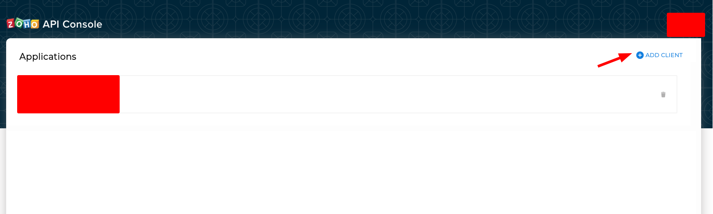

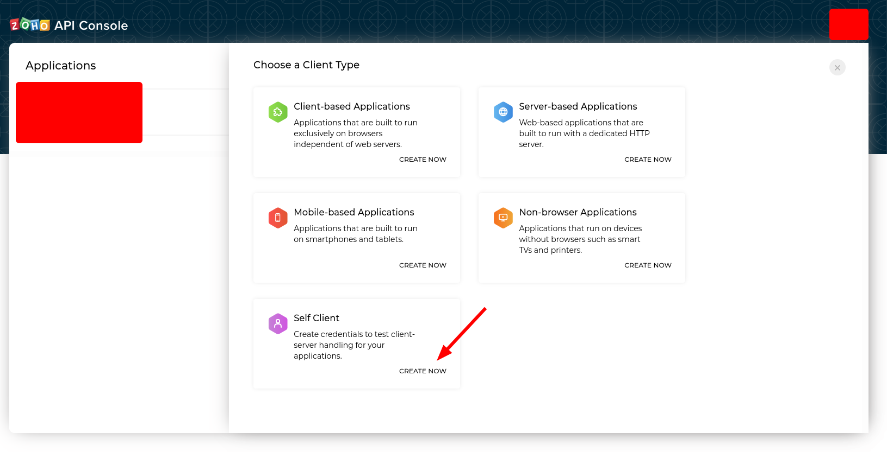

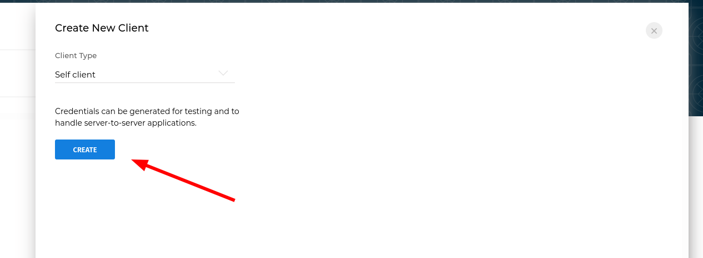

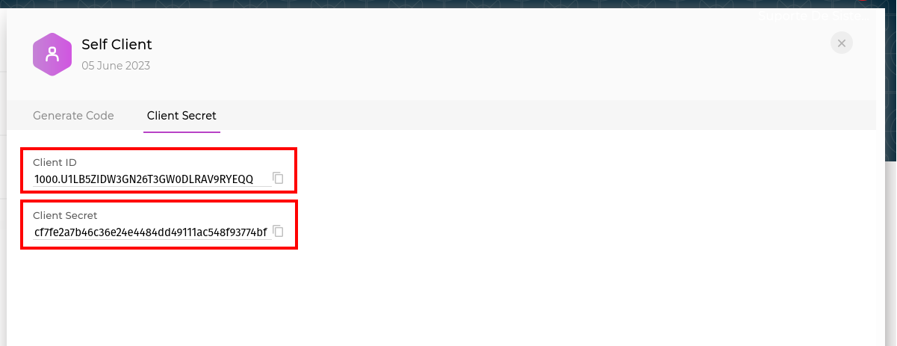

Já conseguimos o Client ID e o Client Secret na aba 'Client Secret'.

Na aba 'Generate Code', coloque o escopo que será usado. Scope são permissões do que o client poderá fazer na API. Ele pode somente ler dados? inserir? deletar? pode ler somente dados de um módulo específico como Leads, Products ou Contracts?

Mais informações sobre [módulos aqui](https://www.zoho.com/crm/developer/docs/api/v4/scopes.html).

Vou dar permissão somente para ler os módulos e configurações: `ZohoCRM.modules.READ,ZohoCRM.settings.ALL`.

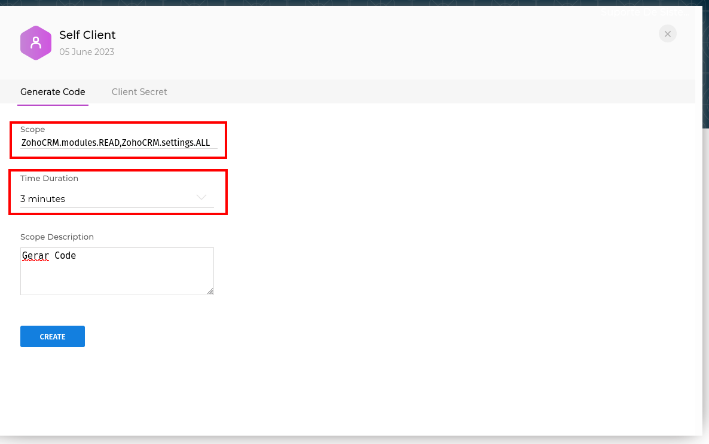

O time duration é o tempo que o authentication code vai durar.

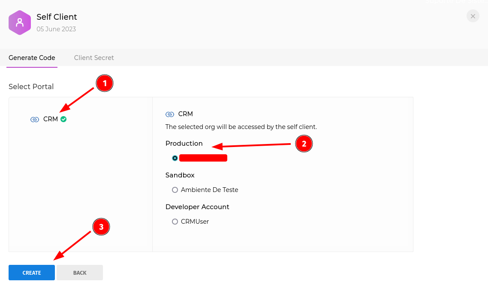

Selecione CRM e depois production.

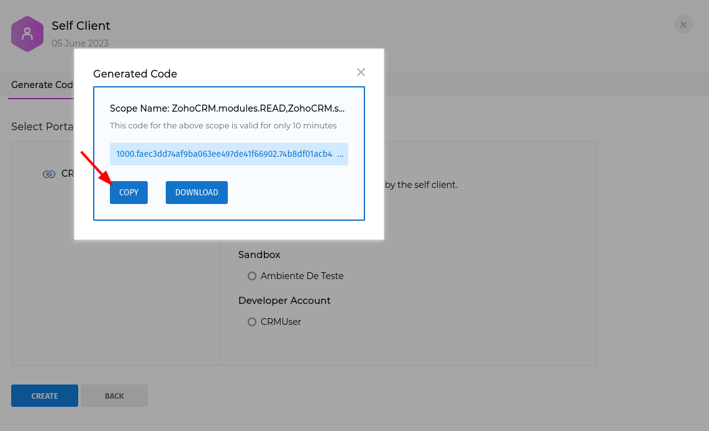

Com as chaves, agora precisamos gerar o access token e refresh token. Para isso vamos para o insomnia.

Como está na [documentação](https://www.zoho.com/crm/developer/docs/api/v4/access-refresh.html), precisamos da url a seguir para gerar os tokens:

https://accounts.zoho.com/oauth/v2/token

Precisamos dos seguintes parametros e o tipo de body deve ser **form-data**:

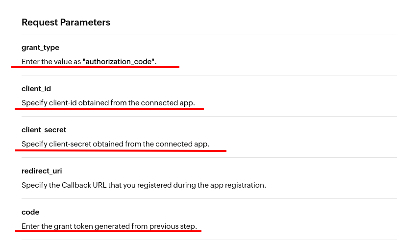

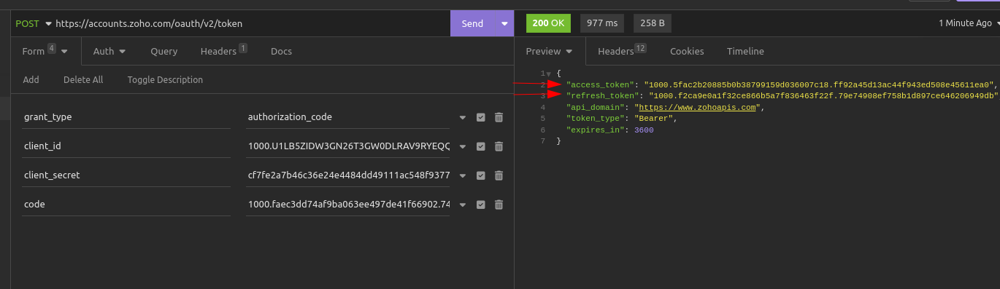

Pronto! Agora temos os tokens. Não se esqueça que o body deve ser do tipo _form-data_ e não _json_ ou qualquer outro.

## Endpoints

Cada requisição ao endpoint a partir de agora, vamos precisar usar o access token. Que seguirá o padrão: `Authorization: Zoho-oauthtoken 1000.xxx...`

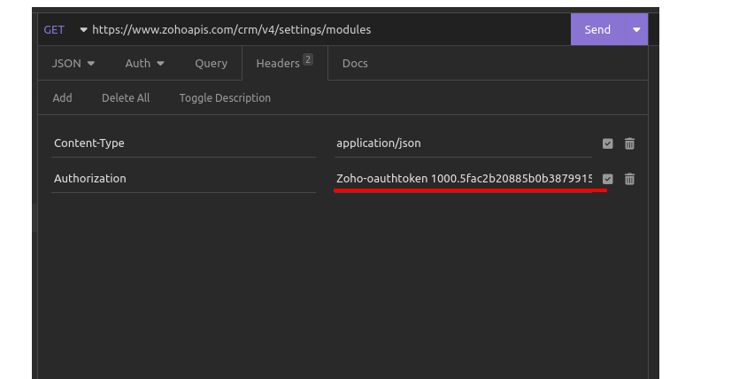

### GET Modules

https://www.zoho.com/crm/developer/docs/api/v4/modules-api.html

Buscando os módulos, temos vários objetos e atributos. Os mais importantes por agora é o id e o api_name, que é por onde vamos buscar os registros em um módulo.

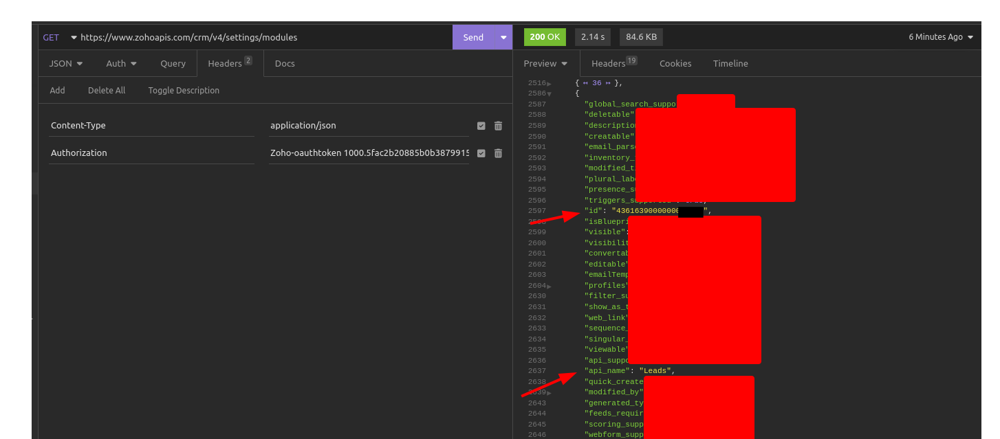

### GET Module Records

A url dos registros buscados, segue o seguinte padrão ([documentação!](https://www.zoho.com/crm/developer/docs/api/v4/modules-api.html)):

https://www.zohoapis.com/crm/v4/Leads

Para buscar campos especificos é através do parametro fields ([documentation?](https://www.zoho.com/crm/developer/docs/api/v4/get-records.html)).

`?fields=id&converted=true&per_page=3`

Busquei por id, pois todo registro de todo módulo deve ter id.

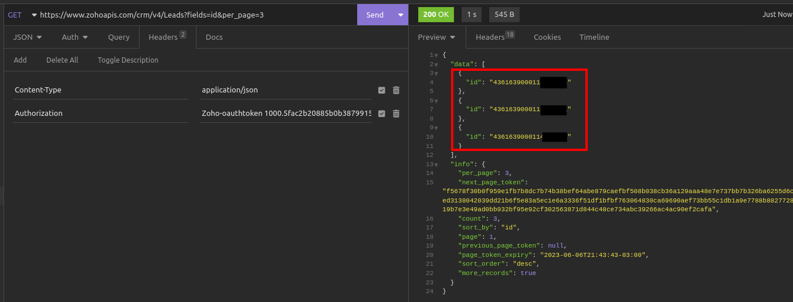

Para saber com mais detalhes quais são os campos que um módulo tem, busque o registro do registro do módulo pelo id, como será mostrado a seguir.

### GET Module Records por ID

[Documentação :)](https://www.zoho.com/crm/developer/docs/api/v4/get-records.html)

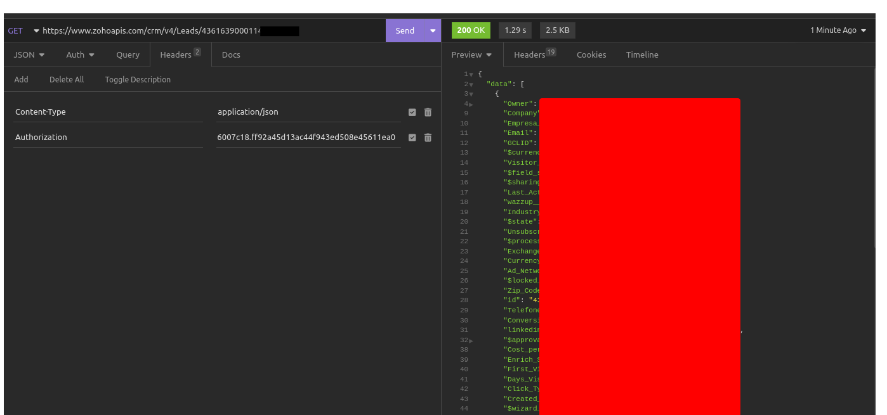

Caso queira buscar campos especificos, pode usar o `fields` no final da url:

https://www.zohoapis.com/crm/v4/Leads/4361639000...44014?fields=State,First_Name

Um outro endpoint muito útil é o [Search Records](https://www.zoho.com/crm/developer/docs/api/v4/search-records.html), onde pode fazer um consulta registros quando um campo for igual a algo.

Chegamos ao fim. Espero ter ajudado.
