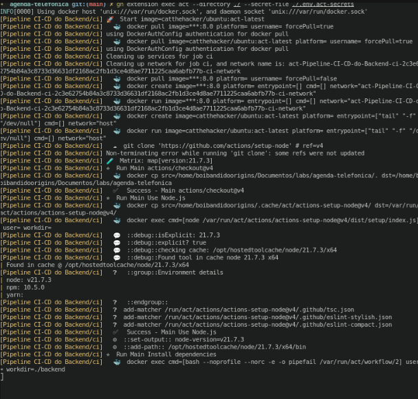

# CI/CD com GitHub Actions e teste local com Act

O uso de pipeline é util para automatizar o processo de deploy, executar testes automatizados, agendar tarefas, fazer verificação de segurança e muitos outros. Qualquer coisa que você queira executar de forma automática, consegue com uma pipeline.

Vamos entender o funcionamento da pipeline do GitHub Actions, usando como base o arquivo do projeto [agenda-telefonica](https://github.com/deirofelippe/agenda-telefonica). O que será explicado?

- Como usar container
- Criação do job de CI
- Criação do job de build do Docker
- Criação de jobs para aletar via Telegram em caso de sucesso e de falha da pipeline
- Usando Act para simular o GitHub Actions

O arquivo completo da pipeline pode ser vista [aqui](https://github.com/deirofelippe/agenda-telefonica/blob/main/.github/workflows/backend.yaml).

## Sumário

- [Ferramentas](#ferramentas)
- [Workflow](#workflow)
  - [Events, filters e environment](#events-filters-e-environment)
  - [Job CI: container, testes e vulnerabilidades](#job-ci-container-testes-e-vulnerabilidades)
    - [Sevices (containers)](#sevices-containers)
    - [Steps](#steps)
  - [Job Build: push Docker Hub](#job-build-push-docker-hub)
  - [Job Notify Success](#job-notify-success)
  - [Job Notify Failure](#job-notify-failure)
- [Simulando o GitHub Actions com Act localmente](#simulando-o-github-actions-com-act-localmente)
- [Conclusão](#conclusão)

## Workflow

Para criar uma pipeline e que ela execute no github, deve seguir esta estrutura:

```bash
.github/
└── workflows/
    └── backend.yaml
```

Todos os arquivos dentro do diretório `workflow/` são pipelines. Todo o código mostrado, ficará dentro de `backend.yaml`.

Para entender as palavras chave da pipeline, pode ser visto [aqui](https://docs.github.com/en/actions/writing-workflows/workflow-syntax-for-github-actions).

### Events, filters e environment

```yaml
name: Pipeline CI-CD do Backend

env:
  WORKDIR: ./backend

on:
  push:
    branches: [main]
  pull_request:
    branches: [main]
  workflow_dispatch:
```

Primeiro definimos o nome do workflow com o `name`.

O `env` são as variáveis que serão usadas nos jobs desse workflow. Foi criado a variável WORKDIR que faz referência ao diretório que alguns comando serão executados.

Agora temos o `on` que define quais serão os eventos e filtros que irão dizer quando o workflow será executado. Esse bloco que dizer que o acionamento desse workflow acontecerá quando:

- Ocorrer o evento `push` na branch `main`.
- Ocorrer o evento `pull_request` na branch `main`.
- Ocorrer o evento `workflow_dispatch`, ou seja, quando for acionado manualmente como por exemplo pelo GitHub via Browser.

A chave `branches` é um filtro e só permite a execução do workflow se o evento `push` ou o `pull_request` for direcionado para a branch `main`.

Mais sobre [events e filters](https://docs.github.com/en/actions/writing-workflows/choosing-when-your-workflow-runs/events-that-trigger-workflows).

### Job CI: container, testes e vulnerabilidades

```yaml
jobs:
  ci:
    runs-on: ubuntu-latest
    strategy:
      matrix:
        version: [21.7.3]

    services:
      mysql:
        image: mysql:8.0
        ports:
          - 3306:3306
        env:
          MYSQL_ROOT_PASSWORD: root
          MYSQL_DATABASE: agenda_test
        options: >-
          --health-cmd "mysqladmin ping"
          --health-interval 10s
          --health-timeout 5s
          --health-retries 5

    steps:
      - uses: actions/checkout@v4

      - name: Use Node.js
        uses: actions/setup-node@v4
        with:
          node-version: ${{ matrix.version }}

      - name: Install dependencies
        working-directory: ${{ env.WORKDIR }}
        run: |
          npm ci

      - name: Run test coverage
        working-directory: ${{ env.WORKDIR }}
        run: npm run test:cov:ci
        env:
          AWS_REGION: ${{ secrets.AWS_REGION }}
          AWS_ACCESS_KEY_ID: ${{ secrets.AWS_ACCESS_KEY_ID }}
          AWS_SECRET_ACCESS_KEY: ${{ secrets.AWS_SECRET_ACCESS_KEY }}

      - name: Check dependencies for vulnerabilities
        working-directory: ${{ env.WORKDIR }}
        run: npm audit --audit-level=high
```

O `jobs` possui outros job, que nesse caso seria o `ci`, `build`, `notify-success` e `notify-failure`. O job ci será executado em uma máquina ubuntu na ultima versão, como diz a chave e o valor `runs-on: ubuntu-latest`.

As chaves `strategy.matrix.version` com o valor `21.7.3`, significa que esse job será executado 1x, mas pode ser executado mais vezes caso coloque mais versões. A versão é referente a do Nodejs que será configurado nessa máquina.

Como os testes de integração usa o MySQL, precisamos de subir um container e a chave `services` faz isso.

#### Sevices (containers)

```yaml
jobs:
  ...

  ci:
    ...

    services:
      mysql:
        image: mysql:8.0
        ports:
          - 3306:3306
        env:
          MYSQL_ROOT_PASSWORD: root
          MYSQL_DATABASE: agenda_test
        options: >-
          --health-cmd "mysqladmin ping"
          --health-interval 10s
          --health-timeout 5s
          --health-retries 5

    ...
```

A chave `mysql` é só um rótulo que damos para esse container. A imagem que será usada é do MySQL versão 8.0 `image: mysql:8.0` e irá ouvir na porta 3306 (`ports:` e `- 3306:3306`). O `env` diz as variáveis de ambiente que será usado e elas precisam ser as mesmas que foi usado no [docker-compose.yaml](https://github.com/deirofelippe/agenda-telefonica/blob/main/docker-compose.yaml) para ser acessado pela aplicação.

O `options` são as flags ou options usadas no comando `docker container create` ([veja sobre aqui](https://docs.github.com/en/actions/writing-workflows/workflow-syntax-for-github-actions#jobsjob_idservicesservice_idoptions)). Os options de healthcheck foi usado para dar continuidade na execução do job quando o container estiver pronto para uso. O que cada um significa?

- `--health-cmd "mysqladmin ping"`: vai executar o comando `mysqladmin ping` dentro do container e vai verificar se o status do mysql está como pronto ou não.
- `--health-interval 10s`: irá executar o teste acima a cada 10s.
- `--health-timeout 5s`: quando um teste é executado, deve esperar 5s para obter resposta dele.
- `--health-retries 5`: o teste será executado no máximo 5x em caso de falhas.

#### Steps

```yaml
jobs:
  ...

  ci:
    ...

    steps:
      - uses: actions/checkout@v4

      - name: Use Node.js
        uses: actions/setup-node@v4
        with:
          node-version: ${{ matrix.version }}

      - name: Install dependencies
        working-directory: ${{ env.WORKDIR }}
        run: |
          npm ci

      - name: Run test coverage
        working-directory: ${{ env.WORKDIR }}
        run: npm run test:cov:ci
        env:
          AWS_REGION: ${{ secrets.AWS_REGION }}
          AWS_ACCESS_KEY_ID: ${{ secrets.AWS_ACCESS_KEY_ID }}
          AWS_SECRET_ACCESS_KEY: ${{ secrets.AWS_SECRET_ACCESS_KEY }}

      - name: Check dependencies for vulnerabilities
        working-directory: ${{ env.WORKDIR }}
        run: npm audit --audit-level=high
```

Temos finalmente as verificações de qualidade e segurança do código que são os `steps`.

Primeiro step é o `uses` vai executar uma action (um script) que seria o `actions/checkout@v4`. Essa action da acesso ao workflow, o código que está no repositorio.

Segundo step é a configuração do nodejs usando a action `actions/setup-node@v4`. Na chave `with`, declaramos o `node-version` passando como valor o `${{ matrix.version }}`, que pega a versão do node que colocamos no `strategy.matrix.version`.

Terceiro step vai instalar as dependências das exatas versões que estão no package-lock.json. O `working-directory` diz em qual diretório que vai ser executado esse step. Na chave `run`, nós escrevemos o comando para ser executado, no cado o `npm ci`.

Quarto step é a execução do teste e da cobertura de código. O comando usado é o `npm run test:cov:ci` que vai setar `NODE_ENV=ci` para usar as configurações do banco de dados do service, que já foi pré definida no código. O `env` possui variáveis de configuração da AWS, porém só a região que precisa ser informada, as outras pode deixar como string vazia. A cobertura de código deve ser superior a 85%, como foi definido no jest.config.js.

O `${{ secrets.VARIAVEL }}` é uma forma de não deixar dados sensíveis à mostra. Mais a diante vou explicar como fazer essa configuração no Act e no GitHub.

Quinto step é uma checagem de vulnerabilidades. Se tiver alguma vulnerabilidade com level high para cima terá um erro.

### Job Build: push Docker Hub

```yaml
jobs:
  ...

  build:
    needs: [ci]
    runs-on: ubuntu-latest

    steps:
      - uses: actions/checkout@v4

      - name: Set up QEMU
        uses: docker/setup-qemu-action@v3

      - name: Set up Docker Buildx
        uses: docker/setup-buildx-action@v3

      - name: Login to Docker Hub
        uses: docker/login-action@v3
        with:
          username: ${{ secrets.DOCKERHUB_USERNAME }}
          password: ${{ secrets.DOCKERHUB_TOKEN }}

      - name: Build and push
        uses: docker/build-push-action@v6
        with:
          context: ${{ env.WORKDIR }}/
          file: ${{ env.WORKDIR }}/Dockerfile
          push: true
          tags: deirofelippe/agenda-telefonica-backend:latest
```

Nesse job será feito o build e o push da imagem docker para o docker hub. O `build` só será executado após o `ci`, essa configuração é feita através do `needs`. Por padrão o GitHub Actions executa os jobs em paralelo e caso queira criar dependência entre eles, torna-los sequencial, deve ser informado no needs.

Primeiro step vai configurar o QEMU que emula plataformas para fazer o build.

Segundo step configura o BuildX para fazer build da imagem.

Terceiro step faz login no docker hub, que será armazenado a imagem.

Quarto step é o que vai realmente fazer o build e o push. Dentro de `with`, vamos configurar o `context` que será a raiz do código, o `file` que será o caminho para o Dockerfile, o `push` que é setado como true, a `tags` que vamos informar o nome e a tag da imagem.

### Job Notify Success

```yaml
jobs:
  ...

  notify-success:
    needs: [build]
    runs-on: ubuntu-latest
    if: ${{ success() }}

    steps:
      - name: Notify Telegram If Success
        run: |
          TELEGRAM_MESSAGE='[Agenda Telefônica] Pipeline foi finalizada'

          CURL_DATA=$(printf '{"chat_id":"%s","text":"%s"}' "${{ secrets.TELEGRAM_CHAT_ID }}" "$TELEGRAM_MESSAGE")

          curl https://api.telegram.org/bot${{ secrets.TELEGRAM_BOT_TOKEN }}/sendMessage \
            --request POST \
            --header 'Content-Type: application/json' \
            --data "$CURL_DATA"
```

Esse job depende do build. A chave e valor `if: ${{ success() }}`, permite a execução desse job somente se não houve erro no build. Caso tenha dado erro no ci, o build não será executado e por consequência o notify-success também não, pois o `success()` retornará falso.

Primeiro step vai notificar via Telegram que a pipeline não teve erro. Será feita uma requisição com o curl, informando a url da API do telegram, o token do bot, o id do chat e a mensagem.

Saiba mais sobre o if [aqui](https://docs.github.com/en/actions/writing-workflows/workflow-syntax-for-github-actions#jobsjob_idstepsif).

### Job Notify Failure

```yaml
jobs:
  ...

  notify-failure:
    needs: [build]
    runs-on: ubuntu-latest
    if: ${{ failure() }}

    steps:
      - name: Notify Telegram If Failure
        run: |
          TELEGRAM_MESSAGE='[Agenda Telefônica] Falha na pipeline'

          CURL_DATA=$(printf '{"chat_id":"%s","text":"%s"}' "${{ secrets.TELEGRAM_CHAT_ID }}" "$TELEGRAM_MESSAGE")

          curl https://api.telegram.org/bot${{ secrets.TELEGRAM_BOT_TOKEN }}/sendMessage \
            --request POST \
            --header 'Content-Type: application/json' \
            --data "$CURL_DATA"
```

Esse job depende do build. A chave e valor `if: ${{ failure() }}`, permite a execução desse job somente se **HOUVER** erro no build.

Primeiro step vai notificar via Telegram que a pipeline teve erro.

## Simulando o GitHub Actions com Act localmente

A instalação do Act pode ser vista [aqui](https://nektosact.com/installation/index.html). É preciso ter o Docker instalado.

Como fiz a instalação usando o GitHub CLI, é só executar o comando `gh extension exec act --directory ./ --job ci --secret-file ./.env.act-secrets`.

Vamos entender o que cada flag significa:

- `--directory` ou `-C` é o diretório onde está o diretório .github
- `--job` ou `-j` é o job especifico que deseja executar. Sim, se eu quiser, posso executar somente o job build, porem se tiver a keyword `needs`, deve ser comentada senão suas dependências serão executadas.
- `--secret-file` é o arquivo no formato .env que será usado como secrets para ser acessado usando `${{ secrets.VARIAVEL }}`




## Conclusão

Obrigado pela leitura :)

Repositório do projeto: [https://github.com/deirofelippe/agenda-telefonica](https://github.com/deirofelippe/agenda-telefonica)
