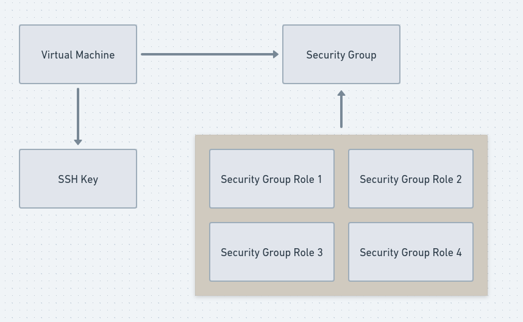
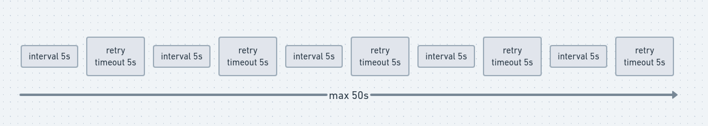
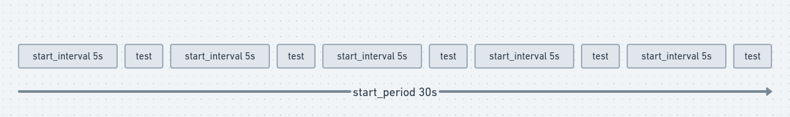
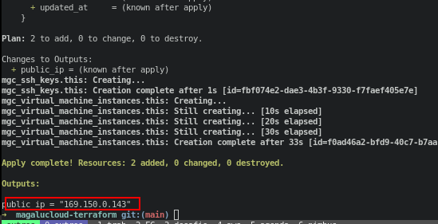
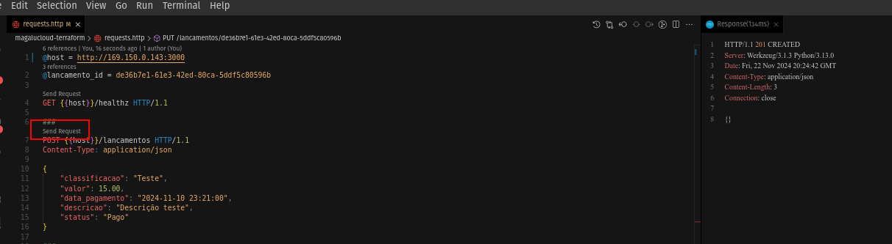
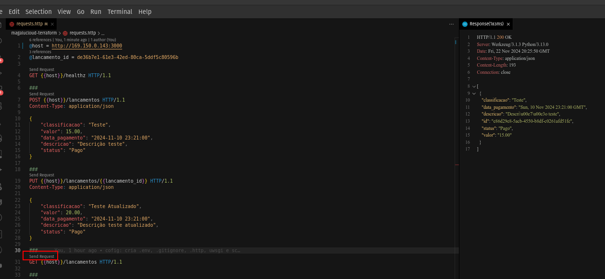

# Vitual Machine e Security Groups com Terraform na Magalu Cloud e Deploy

A idéia desse projeto é executar o docker compose que tem a aplicação backend (feito em Python e Flask) e o banco de dados na Máquina Virtual da Magalu Cloud.

O repositório no github para ver o código do [terraform](https://github.com/deirofelippe/magalucloud-terraform/tree/main/terraform).

## Sumário

- [Ferramentas](#ferramentas)
- [O que será povisionado?](#o-que-será-povisionado)
  - [Provider](#provider)
  - [Virtual Machine](#virtual-machine)
  - [Security Group](#security-group)
  - [Output](#output)
- [Docker Compose](#docker-compose)
- [Criação da infra e Deploy](#criação-da-infra-e-deploy)

## Ferramentas

|   Ferramenta   | Versão |
| :------------: | :----: |
| Terraform CLI  | 1.6.1  |
|   Terraform    | 3.6.2  |
|      MGC       | 0.30.0 |
| Docker Engine  | 23.3.1 |
| Docker Compose | 2.29.7 |
|     Python     | 3.13.0 |
|   PostgreSQL   |  17.1  |

## O que será povisionado?

As referências que cada recurso recebe do outro está resumida no desenho abaixo.



### Provider

Primeiro definimos o provider.

```tf
terraform {
  required_providers {
    mgc = {
      source  = "MagaluCloud/mgc"
      version = "0.30.0"
    }
    random = {
      source  = "hashicorp/random"
      version = "3.6.2"
    }
  }
}

provider "mgc" {
  alias  = "sudeste"
  region = "br-se1"
}
```

No `provider`, as regiões disponíveis são sudeste `br-se1` e nordeste `br-ne1`.

### Virtual Machine

A máquina virtual é equivalente ao AWS EC2, onde você tem controle do que quiser instalar para rodar sua solução, seja scripts, servidores web, qualquer linguagem e etc.

> **Dica:** faça testes localmente com o [Vagrant](https://developer.hashicorp.com/vagrant/install?product_intent=vagrant) antes de provisionar algo pago. No futuro farei um post sobre o vagrant, mas por enquanto tenho um [projeto no github](https://github.com/deirofelippe/agenda-telefonica/blob/main/Vagrantfile) que tem um Vagrantfile para ser usado.

```tf
resource "mgc_virtual_machine_instances" "this" {
  depends_on = [mgc_ssh_keys.this, mgc_network_security_groups.this]
  name       = "mgc-vm-instance"

  machine_type = {
    name = "BV1-1-10"
  }

  image = {
    name = "cloud-ubuntu-24.04 LTS"
  }

  network = {
    associate_public_ip = true
    delete_public_ip    = true

    interface = {
      security_groups = [{
        id = mgc_network_security_groups.this.id
      }]
    }
  }

  ssh_key_name = mgc_ssh_keys.this.name
}
```

O `depends_on` cria dependência com o recurso `mgc_ssh_keys` e `mgc_network_security_groups`. A máquina virtual atual só será criado após a criação de quem ele depende.

No atributo `machine_type`, o valor usado é o `BV1-1-10`, que possui 1 vCPU e 1GB de RAM. Essas informações são encontradas ao criar a instância no site.

A `image` usada é o `cloud-ubuntu-24.04 LTS`. Os valores desse atributo pode ser visto listando os detalhes da instância pelo cli.

No atributo `network`, temos o campo `associate_public_ip` que indica que ao criar a instância, deverá ser cria um IP público e o campo `delete_public_ip` indica que ao destruir a instância, o IP gerado também deverá ser deletado. Importante saber que o IP público tem custo.

O atributo `interface` possui o atributo `security_groups` onde deverá ser atribuido o id do security group criado, que será explicado mais adiante.

Por fim temos o campo `ssh_key_name` que seu valor deve ser atribuido ao campo `name` recurso `mgc_ssh_keys`, não o seu id.

```tf
resource "random_string" "this" {
  length      = 5
  special     = false
  lower       = true
  min_numeric = 2
  min_lower   = 3
}

resource "mgc_ssh_keys" "this" {
  provider = mgc.sudeste
  name     = "mgc_ssh_key_${random_string.this.id}"
  key      = file("../mgc_ssh_key.pub")
}
```

No recurso `mgc_ssh_keys` indicamos o `provider` que ele pertence, o `name` que será referenciado no recurso `mgc_virtual_machine_instances` e que foi concatenado com uma string aleatória gerado pelo recurso `random_string`. O conteúdo da chave pública deverá ser colocada no campo `key`, a função file pega o conteúdo de um arquivo e atribui no campo.

> A geração da chave SSH está [nessa seção](#criação-da-infra-e-deploy).

### Security Group

O security group são regras de tráfego, por padrão na Magalu Cloud, todo o [tráfego é bloqueado](https://docs.magalu.cloud/docs/network/overview) e deve ser configurado as permissões. Um resumo do que será permitido nesse arquivo:

- Tráfego de entrada pela porta 22 (SSH) para o meu IP (`x.x.x.x/32`).
- Tráfego de entrada pela porta 3000 para a comunicação de qualquer IP com a aplicação (`0.0.0.0/0`).
- Tráfego de saída pela porta 80 (HTTP) para todos os hosts locais (`0.0.0.0/0`).
- Tráfego de entrada pela porta 80 (HTTP) para todos os IPs (`0.0.0.0/0`).

```tf
resource "mgc_network_security_groups" "this" {
  name        = "mgc-network-security-group"
  description = "MGC Network Security Group"
}
```

Sem mistério, essa é a criação do security group, as regras de permissão serão atribuidas a ela.

```tf
data "http" "my_ip" {
  url = "http://ipv4.icanhazip.com"
}

resource "mgc_network_security_groups_rules" "allow_ingress_ssh" {
  depends_on        = [mgc_network_security_groups.this]
  description       = "Permite tráfego SSH de entrada somente do meu IP"
  direction         = "ingress"
  ethertype         = "IPv4"
  port_range_min    = 22
  port_range_max    = 22
  protocol          = "tcp"
  remote_ip_prefix  = "${trimspace(data.http.my_ip.response_body)}/32"
  security_group_id = mgc_network_security_groups.this.id
}
```

O nosso primeiro recurso `mgc_network_security_groups_rules` vai depender o recurso `mgc_network_security_groups` referenciado no campo `depends_on`.

A regra de entrada de tráfego será informada no campo `direction` com o valor `ingress`, pela porta `22` definida no `port_range_min` e `port_range_max`, usando o protocolo `tcp` e será usado também o protocolo `IPv4` definido em `ethertype`.

O IP permitido, definido no `remote_ip_prefix`, é o público de sua rede que será buscado dinâmicamente via requisição http para a url `http://ipv4.icanhazip.com`. O `http` é o data source que fará a requisição e retornará o IP público. A função `trimspace()` irá tirar os espaços em branco da string e o /32 no final do IP vai dizer que é exatamente esse IP que será permitido, pois a máscara /32 permite somente um IP.

Por fim, essa regra será aplicada no security group referenciado no campo `security_group_id`.

```tf
resource "mgc_network_security_groups_rules" "allow_ingress_http" {
  depends_on        = [mgc_network_security_groups.this]
  description       = "Permite tráfego HTTP de entrada para todos os IPs"
  direction         = "ingress"
  ethertype         = "IPv4"
  port_range_min    = 80
  port_range_max    = 80
  protocol          = "tcp"
  remote_ip_prefix  = "0.0.0.0/0"
  security_group_id = mgc_network_security_groups.this.id
}
```

Nossa segunda regra permite o tráfego de entrada (`ingress` no `direction`), na porta `80` (`port_range_min` e `port_range_max`) pelo protocolo `tcp` (no `protocol`). O IP seguirá o protocolo `IPv4` (no `ethertype`) e o IP em si será qualquer um `0.0.0.0/0` (no `remote_ip_prefix`).

```tf
resource "mgc_network_security_groups_rules" "allow_egress_http" {
  depends_on        = [mgc_network_security_groups.this]
  description       = "Permite tráfego HTTP de saída"
  direction         = "egress"
  ethertype         = "IPv4"
  port_range_min    = 80
  port_range_max    = 80
  protocol          = "tcp"
  remote_ip_prefix  = "0.0.0.0/0"
  security_group_id = mgc_network_security_groups.this.id
}
```

Nossa terceira regra, dessa vez permite o tráfego de saída `egress` (no `direction`), ou seja, o processo que escutar na porta `80` (`port_range_min` e `port_range_max`) poderá fazer requisição a qualquer recurso externo usando p protocolo `tcp` (no `protocol`). O IP seguirá o protocolo `IPv4` (no `ethertype`) e o IP será qualquer um `0.0.0.0/0` (no `remote_ip_prefix`).

```tf
resource "mgc_network_security_groups_rules" "allow_ingress_app" {
  depends_on        = [mgc_network_security_groups.this]
  description       = "Permite tráfego do App de entrada"
  direction         = "ingress"
  ethertype         = "IPv4"
  port_range_min    = 3000
  port_range_max    = 3000
  protocol          = "tcp"
  remote_ip_prefix  = "0.0.0.0/0"
  security_group_id = mgc_network_security_groups.this.id
}
```

Nossa quarta e última regra permite o tráfego de entrada (`ingress` no `direction`), na porta `3000` (`port_range_min` e `port_range_max`), que será a porta de nossa aplicação, e usará protocolo `tcp` (no `protocol`). O IP seguirá o protocolo `IPv4` (no `ethertype`) e o IP será qualquer um `0.0.0.0/0` (no `remote_ip_prefix`).

### Output

```tf
output "public_ip" {
  description = "IP Público"
  value       = mgc_virtual_machine_instances.this.network.public_address
}
```

No fim do provisionamento da infraestrutura, será exibido pelo `output` o IP público, através do campo `public_address`, gerado para o acesso à máquina virtual.

## Docker Compose

Farei uma breve explicação sobre o serviço do backend das funcionalidades mais importantes usadas.

```docker
backend:
  image: deirofelippe/magalucloud-terraform:v1.1
  container_name: backend
  ports:
    - "3000:3000"
  restart: always
  env_file:
    - ./.env
  depends_on:
    database:
      condition: service_healthy
  healthcheck:
    test: ["CMD", "curl", "-f", "http://localhost:3000/healthz"]
    interval: 5s
    retries: 5
    timeout: 5s
    start_period: 30s
    start_interval: 5s
```

A imagem `deirofelippe/magalucloud-terraform:v1.1` usada, pode ser acessada no [Docker Hub](https://hub.docker.com/r/deirofelippe/magalucloud-terraform), contém o código do backend.

O atributo `restart` com o valor `always` irá reiniciar o container sempre que ele der erro e finalizar a aplicação.

O docker compose vai injetar variáveis de ambiente no container usando o `env_file`, essa abordagem é mais dinâmica e mais segura que por as variáveis na imagem ou declará-las no atributo `environment`.

O `depends_on` diz que irá criar o container `backend` depois que a condição (`condition`) do serviço `database` estiver saudável (`service_healthy`). Essa verificação de saúde do serviço será feito pelo atributo `healthcheck` no serviço do banco de dados.

O healthcheck irá testar (`test`) a saúde do container criado com o comando `curl -f http://localhost:3000/healthz`. Esse comando irá fazer uma requisição para a rota /healthz e vai esperar status code 2XX como resposta. A implementação dessa rota faz acesso ao banco de dados e caso ocorra tudo certo, irá retornar status code 200. Se a aplicação não responder em um espaço de tempo de 5s (`timeout`), será considerado uma falha e todo o processo irá se repetir 5 vezes (`retries`) em um espaço de tempo entre cada tentativa de 5s (`interval`). Caso os testes não passem, o container será considerado como `unhealthy`.

O funcionamento do interval, retry e timeout está melhor explicada na imagem abaixo.



Antes de começar os testes e dizer o estado do container, o docker espera 30s para a aplicação iniciar (`start_period`), mas testes serão feitos durante o `start_period` em um espaço de 5s (`start_interval`) entre cada teste. Se a aplicação responder positivamente, ela será considerada saudável e sairá do start_period, caso contrário, o container ainda não será considerado como unhealthy, pois ainda está não passou o tempo do start_period.



Na documentação do docker, você vai encontrar explicação mais detalhada sobre o [depends_on](https://docs.docker.com/compose/how-tos/startup-order/) e o healthcheck([aqui](https://docs.docker.com/reference/compose-file/services/#healthcheck), [aqui](https://docs.docker.com/reference/dockerfile/#healthcheck) e [aqui](https://docs.docker.com/reference/compose-file/extension/#specifying-durations)).

## Criação da infra e Deploy

1. Baixe o código `git clone https://github.com/deirofelippe/magalucloud-terraform.git`

1. `cd ./magalucloud-terraform`

1. Para gerar essa chave, use o comando `ssh-keygen -t rsa -b 2048 -f ./mgc_ssh_key -N ""`.
   - Irá criar um par de chave pública e privada do tipo rsa `-t rsa`, com 2048 bits `-b 2048`, o nome do arquivo será mgc_ssh_key e será criado na pasta atual `-f ./mgc_ssh_key`, por ultimo será gerado uma nova passphrase com valor vazio `-N ""`.
   - O comando irá gerar a chave privada `mgc_ssh_key` e a chave pública `mgc_ssh_key.pub`. A chave privada sempre ficará com você e a chave pública ficará no servidor desejado. O terraform vai fazer o upload e a configuração da chave pública no servidor automaticamente, não necessitando do uso do comando `ssh-copy-id` para fazer o ssh remoto conceder o acesso sem o uso de senha.
1. Gere os arquivos de configuração: `terraform -chdir=./terraform init`

1. Veja o plano de execução: `terraform -chdir=./terraform plan`

1. Criar a infra no provedor: `terraform -chdir=./terraform apply -auto-approve`

1. Copie o IP público gerado e cole nos comandos abaixo, trocando o `<IP-PÚBLICO>` e execute-os.

   

1. Teste o acesso com o comando `ssh -i ./mgc_ssh_key -p 22 ubuntu@<IP-PÚBLICO>`

1. `rsync -vahz -e 'ssh -i ./mgc_ssh_key -p 22' ./scripts ubuntu@<IP-PÚBLICO>:/home/ubuntu`

   - executa por baixo dos panos o ssh com as options informado pelo `-e`, vai transferir o diretório ./script para o host <usuario>@<host>:<destino>.

1. `rsync -vahz -e 'ssh -i ./mgc_ssh_key -p 22' ./.env ./docker-compose.prod.yaml ubuntu@<IP-PÚBLICO>:/home/ubuntu/scripts`

1. Execute o arquivo remotamente que irá instalar o docker e executar o docker compose: `ssh -i ./mgc_ssh_key -p 22 ubuntu@<IP-PÚBLICO> "bash -c './scripts/config-virtual-machine.sh'"`

1. No arquivo [./requests.http](https://github.com/deirofelippe/magalucloud-terraform/blob/main/requests.http) do repositório, possui as requests que podem ser feitas.

   

   

1. Ao final destrua os recursos criados `terraform -chdir=./terraform destroy -auto-approve`.
